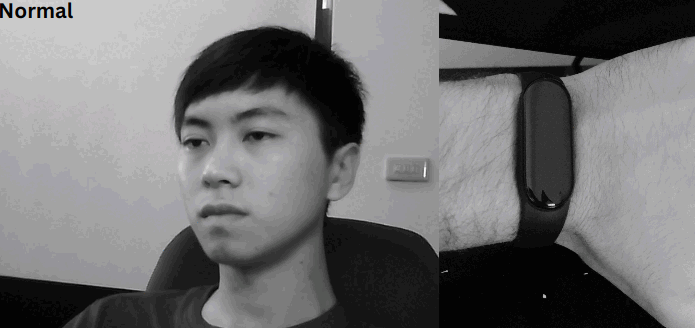

### Driver Security System

Non-invasive driver security system implemented in Python. It includes:

+ Heart Rate Monitoring
+ Drowsiness Detection
+ Distraction Detection
+ Vibrating Alerts



## Requirements

This project was made using these adapted repositories:

+ [tiny-ECDH-python](https://github.com/danielsousaoliveira/tiny-ECDH-python)
+ [miband-HR-python](https://github.com/danielsousaoliveira/miband-HR-python)

Please check both of them first and install dependencies:

```
sudo apt-get install libglib2.0-dev
pip3 install -r requirements.txt
```

## How it works

This system uses multi-threading to have different tasks running at the same time:

1. Connect with Mi Band6 using [miband-HR-python](https://github.com/danielsousaoliveira/miband-HR-python).
2. Retrieve heart rate continuously using the band.
3. Acquire video from the camera and detect the driver's face using Mediapipe Face Detector.
4. Load the drowsiness/distraction detection model, and infer the driver's state on each frame.
5. Make a temporal analysis to estimate the drowsiness/distraction level.
6. Send a vibrating alert in case the same level is above the threshold.

## How to test

The end goal of this project is to create a real-time system, to be implemented in a vehicle, using an embedded computer and a camera.
However, it still has to be optimized to be used in real time. Currently, it works at around 24 fps, but the band connection increases the processing time by 10 times, making the whole system too slow for real-time usage.
The solution for this can be the usage of the C library instead ([miband-HR-C](https://github.com/danielsousaoliveira/miband-HR-C)), which is way faster.

For testing purposes, the following steps are needed:

1. Clone this repository
2. Find your Mi Band's Authentication Key ([Check Here](https://codeberg.org/argrento/huami-token))
3. Put your authentication key to `auth_key.txt` file in the current directory. 
4. Turn off Bluetooth on your mobile device paired with the band
5. Find out your band MAC address using bluetoothctl or other tool
```
sudo bluetoothctl
scan on
devices
```
6. Add your model to the repository
7. Run main script
```
python3 main.py -m MAC_ADDRESS -l your_model.h5
``` 

## References

- [gzalo/miband-6-heart-rate-monitor](https://github.com/gzalo/miband-6-heart-rate-monitor)
- [patyork/miband-7-monitor](https://github.com/patyork/miband-7-monitor) 
- [Jaapp-/miband-5-heart-rate-monitor](https://github.com/Jaapp-/miband-5-heart-rate-monitor)
- [satcar77/miband4](https://github.com/satcar77/miband4)
- [vshymanskyy/miband-js](https://github.com/vshymanskyy/miband-js)
- [vshymanskyy/miband2-python-test](https://github.com/vshymanskyy/miband2-python-test)
- [VladKolerts/miband4](https://github.com/VladKolerts/miband4)
- [Gadgetbridge](https://codeberg.org/Freeyourgadget/Gadgetbridge)
- [NTHU-DDD Dataset](https://cv.cs.nthu.edu.tw/php/callforpaper/datasets/DDD/)

DISCLAIMER: 
Please be aware that this work was done as academic research and should not be used for commercial purposes.
The dataset used was accessed within the scope of this study and should not be used without permission.
Three different models were trained using the same dataset and will not be shared for the same reason above.
This work will be further described in an academic paper still to be published.

## Libraries

- [tiny-ECDH-python](https://github.com/danielsousaoliveira/tiny-ECDH-python)
- [miband-HR-python](https://github.com/danielsousaoliveira/miband-HR-python)
- [miband-HR-C](https://github.com/danielsousaoliveira/miband-HR-C)
- [gatt-python](https://github.com/getsenic/gatt-python)
- [pycryptodome](https://github.com/Legrandin/pycryptodome)

## TODO

1. Optimize code for real-life implementation
